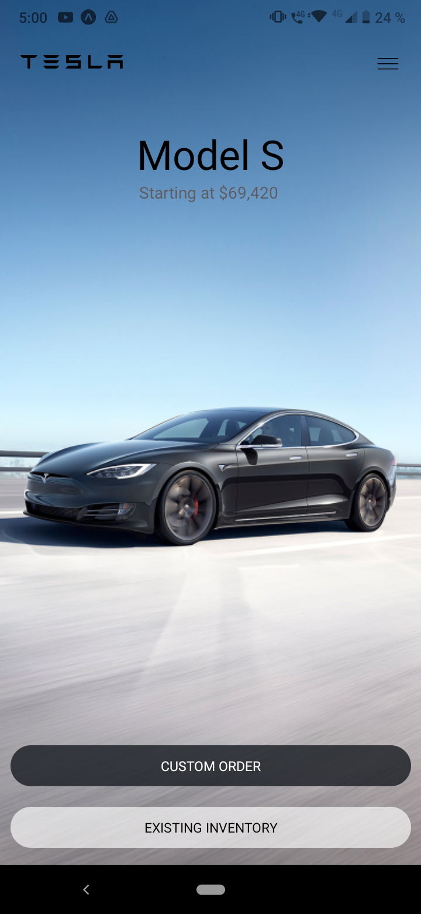

# Tesla clon app

This is an exercise to improve the form in what I make the layout of react-native applications.

## Installation
To install and run this proyect just type and execute
```bash
npm install
```

## Usage
```bash
npm start
```
### Gif


### Screenshot




## My process

### Built with

- React Native
- CSS properties
- Flexbox
- Javascript
- Ecmascript 6+

### What I learned

I learned about the use of relative and dimensional measurements of devices in RN.
How absolute positions work in RN.
Reuse of RN components thanks to their standardization.
Tiktok-style viewport rendering


```jsx
<View style={styles.container}>
    <FlatList
        data={cars}
        renderItem={({ item }) => <CarItem car={item} />}
        snapToAlignment={"start"}
        snapToInterval={Dimensions.get("screen").height}
        decelerationRate={"fast"}
    />
</View>
```
```css
const styles = StyleSheet.create({
	carContainer: {
		width: "100%",
		height: Dimensions.get('screen').height,
	},
})
```

## Author

- Website : [Omar Dario Melendrez](https://omardario.online)


